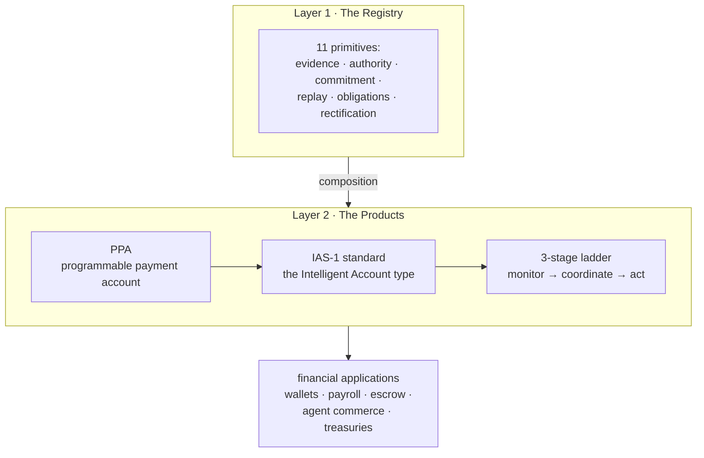
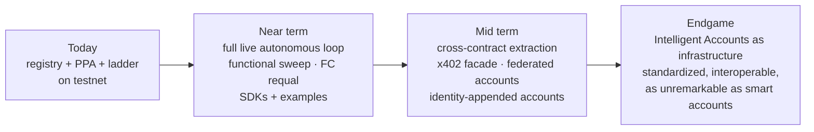

# Nomos

### Financial primitives whose semantics survive any builder — and the Intelligent Accounts built on them

**The Master Whitepaper · Version 1.0 · August 2026**

---

## Abstract

Nomos is a governed primitive stack for GenLayer: eleven independently certified financial mechanisms, a user-facing Programmable Payment Account (PPA), a published account-type standard (IAS-1), and a three-stage ladder of Intelligent Accounts that can observe the world, correlate signals, and act within hard deterministic caps.

The project's thesis is twofold. First, that financial primitives survive real-world use only if their semantics survive *reimplementation by strangers* — which is why ten of eleven Nomos primitives are CONFORMANT: rebuilt from specifications alone by fresh-context builders who never saw the reference code, with every canonical vector passing against every independent build. Second, that on chains whose consensus can evaluate language models under declared equivalence principles, accounts themselves should become intelligent — provided one structural line holds everywhere: **judgment proposes; determinism disposes.**

This paper states what was built, what was proven, how it was proven, and where the road goes.

---

## 1. The problem in one paragraph

Financial applications keep re-deriving the same machinery: evidence that something happened, authority to act on it, allocation of capital against mandates, commitment so promises cannot exceed funds, replay protection so authorizations cannot be reused, obligation lifecycles, and dispute rectification when reality disagrees with expectations. Each reimplementation is slightly wrong in ways that surface as fund loss. Meanwhile AI agents need to hold and move money under scopes narrower than "holds the keys," and LLM-capable chains create the temptation — increasingly acted upon — to let model output release funds directly. Both problems are architecture problems.

## 2. The two-layer answer

*Figure 1 — Two layers, one guarantee system. The registry supplies verified mechanisms; the products supply usability. Both are deployed on GenLayer Testnet Bradbury.*

### Layer 1 — The registry

Eleven primitives, each specified (SPEC.md, INVARIANTS, THREAT_MODEL, DECISION_BOUNDARY), implemented as a GenLayer Intelligent Contract, and tested against canonical vector suites:

| # | Primitive | Role | Status |
|---|---|---|---|
| 1 | Proof of Payable | Evidence-bearing claims → settlement | CONFORMANT |
| 2 | Claim Verification | LLM clause interpretation under semantic consensus | CONFORMANT |
| 3 | Policy Envelope | Deterministic spend gates, audited denials | CONFORMANT |
| 4 | Workflow Authorization | Propose/accept/execute pacts with validity windows | CONFORMANT |
| 5 | Mandate Allocation | Capital eligibility under mandates | CONFORMANT |
| 6 | Dynamic Authority Allocation | Authority awarded as bounded capacity | CONFORMANT |
| 7 | Claim Encumbrance | Reservations that prevent overcommitment | CONFORMANT |
| 8 | Capital Commitment | Committed-vs-available accounting | CONFORMANT |
| 9 | Dynamic Authorization Lanes | Replay-proof execution nonces | CONFORMANT |
| 10 | Gaia | Dispute cases, compensating-entry remedies | CONFORMANT |
| 11 | Financial Contract | Obligation/cash-flow lifecycle | SPECIFIED* |

*\*Converged via independent lane (9/9 vectors); blocked from CONFORMANT only by a scope re-qualification of its public state model.*

**What CONFORMANT means here.** A fresh-context builder — an agent with no access to our implementations or conversations — received only the specification, governance documents, and canonical vectors, and rebuilt the mechanism from scratch. Every canonical vector then passed against the independent build. Ten primitives have survived this test (~90 independent vector passes). This is the strongest claim in the repository: *the specifications are sufficient for a stranger to reconstruct the behavior.*

### Layer 2 — The products

**The PPA** packages the registry behind verbs people understand — `send`, `invoice`, `dispute`, `delegate` — with four unskippable gates on every payment (policy → encumbrance → claim → settle), committed-vs-available accounting making overcommitment structurally impossible, disputes resolved by compensating entries rather than history edits, and delegation that narrows and never widens. Its complete payment cycle is live-verified on Testnet Bradbury with exact balance reconciliation.

**IAS-1 and the ladder** extend the account upward: monitors observe web data through comparative validator consensus; a coordinator correlates n-of-M signals within time windows and scores confidence; an executor routes confirmed signals into the same gate pipeline a human uses — under per-action caps, daily autonomous ceilings, recipient allowlists, and a kill switch that defaults off.

---

## 3. The invariant

One line is enforced everywhere, at every layer:

> **Judgment proposes. Determinism disposes.**

LLMs observe web pages and extract metrics — under comparative equivalence, where validators re-execute the observation and agree within tolerance. LLMs classify disputes into categories — under semantic consensus. But no model output ever directly mutates a balance. Proposals enter the identical gate pipeline as human-signed actions; the pipeline is integer arithmetic; denials are permanent audit records that move nothing.

The worst case under total judgment failure is a pile of denied-payment records. This is by construction, verified adversarially: the test suite attempts to drive judgment output straight into state and lands on a denial every time.

---

## 4. How it was proven

Evidence discipline is constitutional in Nomos: claims use PASS / FAIL / NOT_IMPLEMENTED / BLOCKED, and each carries its receipt.

**Independent convergence.** Eight fresh-context lanes rebuilt primitives from spec-only artifacts. Every lane's build passed every canonical vector. Receipts: `RECEIPT-CONV-{POP,WA,PE,DAL,DAA,MA,FC,GAIA}-B`. One lane caught a genuine spec gap (maturity gating payments) purely from vectors — the process corrects specifications, not just confirms them.

**Live network verification.** Sixteen contracts deployed on Testnet Bradbury with bytecode verification. The PPA completed a full live lifecycle: initialize → create_account → deposit 3,000 → gated send 1,200 → payment SETTLED → balance read-back 1,800 (exact). Account, policy, group, and kill-switch operations for the IAS stages landed live.

**Real-model consensus.** The judgment register was validated on mainline validators running GPT-OSS, Qwen, GPT-5.4, and Claude Sonnet 4.6 — four heterogeneous models fetching a live URL, extracting a metric, comparing under tolerance-based equivalence, voting through a leader rotation, and finalizing (`RECEIPT-IAS-DIVERSITY-001-A`).

**Sim suites.** Every primitive and composite passes canonical vectors plus adversarial batteries (replay, stale evidence, concurrent requests, overcommitment, revocation edges) on GLSim through full GenVM consensus.

**Honest gaps,** stated plainly: financial-contract awaits scope re-qualification; invoice/dispute/delegation paths on the PPA are sim-proven but not yet fired live; the Stage-3 continuous loop has its deterministic spine live and its judgment step validated separately, but one uninterrupted live run remains open — blocked on testnet data-source rate limiting (a third-party API returned HTTP 429 to validators' shared egress, correctly refused by consensus) and node variance. These are tracked, not hidden.

---

## 5. What it enables

- **Agents with bank-account-grade scopes.** Delegation caps + expiry + replay-proof lanes + instant revocation: an agent holds a *delegation*, not the treasury.
- **Machine-native commerce.** Two Intelligent Accounts transacting: A's monitors confirm performance, A's gates pay B, B's policies admit the payment. No keys exchanged; every step auditable.
- **Dispute-native settlement.** Gaia-style case lifecycle built in — disagreements open cases instead of escalating to social recovery.
- **Self-defending treasuries.** Monitors watch exposure surfaces and propose defensive pauses before humans notice.
- **A standard others can build on.** IAS-1 defines five modules (authority, policy, settlement, judgment interface, rectification) and conformance levels that map to risk tiers.

---

## 6. Future intentions

*Figure 2 — The road. Near-term items are engineering; mid-term items are composition; the endgame is disappearance into infrastructure.*

**Near term:** close the three open verification items (live Stage-3 loop, functional sweep across all contracts, financial-contract re-qualification). Ship SDK/client helpers per primitive — the CAPABILITY.json files already define the surfaces.

**Mid term:** cross-contract extraction so the PPA calls deployed primitives directly, restoring per-primitive attestation chains. An x402 facade exposing PPA payments to the agentic-commerce rail. Federated Intelligent Accounts trading with each other under mutual monitoring. Identity-appended accounts — cryptographic bindings to email/ENS/attestations kept in a separate module — enabling rules like *"my agent pays invoices addressed to me, up to $200/month."*

**Endgame:** the standardization play. If Intelligent Accounts become a category, Nomos intends to be the reference implementation and IAS-1 the interface others certify against. The registry's convergence protocol — specs sufficient for strangers to rebuild — is itself the template for how such a standard would be governed.

---

## 7. Conclusion

Nomos began as a question: can financial mechanisms be specified so precisely that any builder reproduces them identically? Ten independent builds say yes.

It became a second question: can accounts on a reasoning chain hold intelligence without surrendering their ledger to it? A deployed, partially-live implementation says yes — with the boundary drawn in execution semantics, not documentation.

Both answers compose into one posture for the agentic economy:

> **Specifications strong enough to survive strangers. Accounts smart enough to watch the world. Ledgers deterministic enough to trust anyway.**

Determinism settles. Judgment advises. Everything else is engineering.

---

*Nomos Project · etvjay/Nomos · Testnet Bradbury (chainId 4221) · Companion documents: `primitives/ppa/WHITEPAPER.md` (PPA), `primitives/ppa/INTELLIGENT_ACCOUNT_WHITEPAPER.md` (Intelligent Accounts), `primitives/ppa/IAS-1.md` (the standard).*
