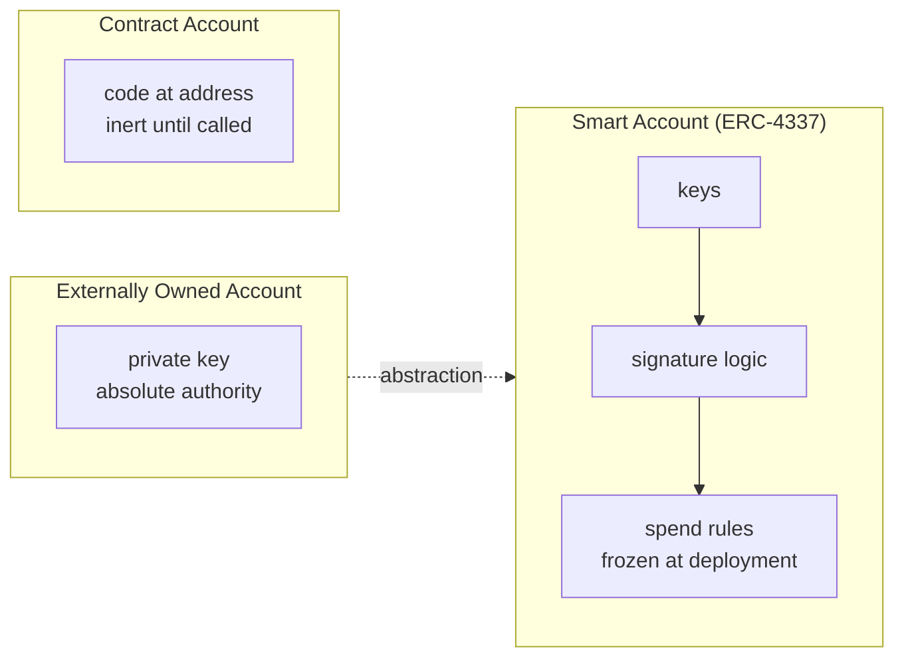
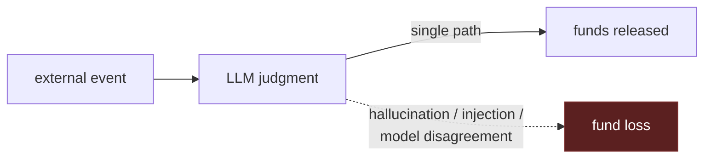
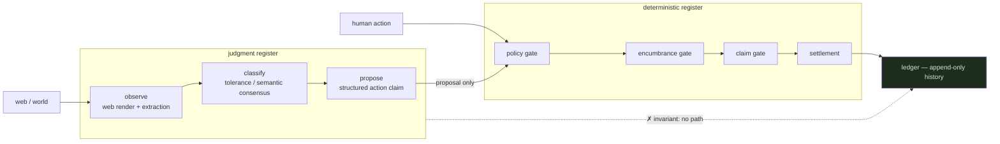
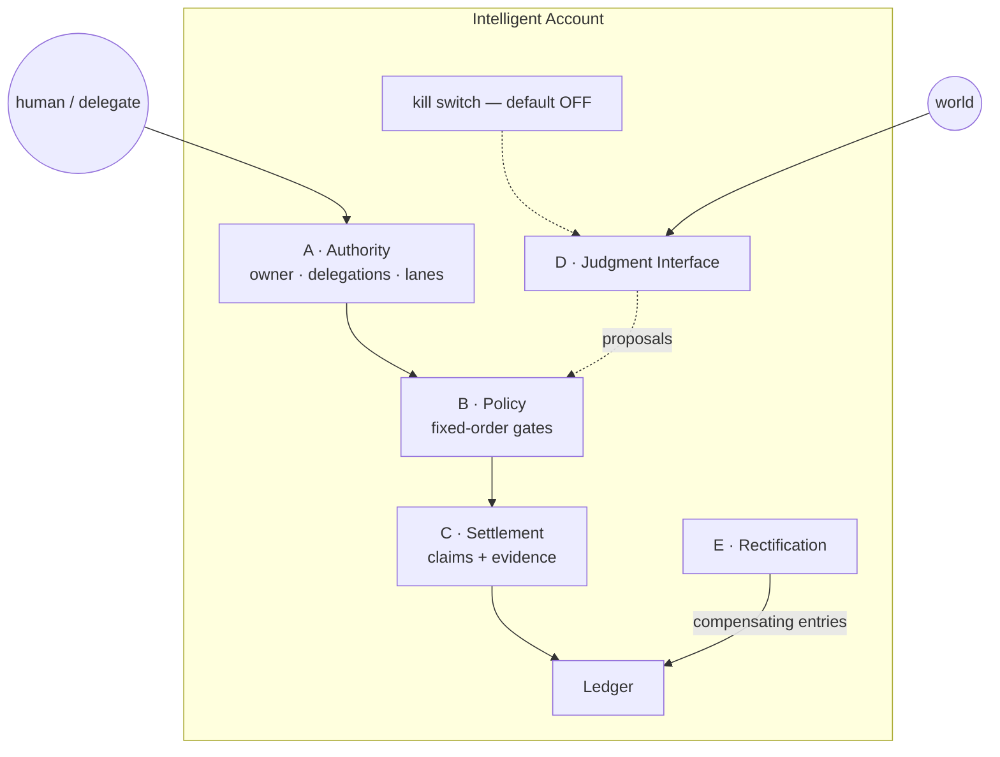
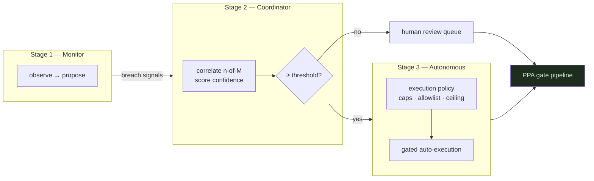
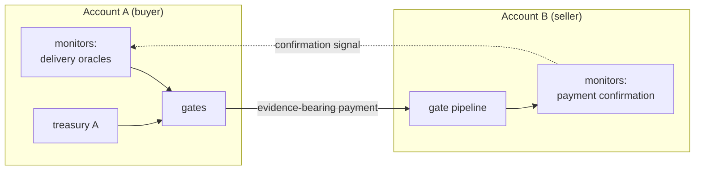

# The Intelligent Account

### A new account type for chains that reason

**Nomos Project · Version 1.0 · August 2026**

---

## Abstract

Blockchains have two account types: keys and code. Keys are brittle; code is blind. Account abstraction made the code flexible, but its rules remain frozen at deploy time — unable to observe the world, interpret events, or adapt to what actually happened.

On a consensus layer whose validators can evaluate large language models under declared equivalence principles, a third account type becomes possible. We call it the **Intelligent Account**: an account that can observe external reality, classify unstructured events, and propose actions through validator consensus — while every value-moving decision remains deterministic by construction.

This paper defines the Intelligent Account, specifies its five-module architecture and its single structural invariant (*judgment proposes; determinism disposes*), presents a three-tier autonomy ladder that maps conformance levels to risk appetite, reports on a working implementation deployed to GenLayer's testnet with real-model comparative consensus validated across four distinct LLM backends, and states precisely what the model does not solve.

---

## 1. The default assumption

Ethereum's account model has been copied nearly everywhere:

*Figure 1 — The evolution of accounts. Each step made authorization more programmable, but the program remained static: rules written once by a deployer, executed without regard to anything outside the chain.*

The smart account was a genuine advance. It replaced "one key, total power" with composable authorization logic — session keys, spending caps, social recovery, batched calls. An entire industry (Safe, ZeroDev, embedded wallets) stands on it.

But examine what a smart account *knows*. Its rules reference only on-chain state: balances, nonces, block timestamps, calldata. It cannot read a delivery confirmation, notice that an oracle feed died, recognize that a counterparty has disputed three shipments this month, or distinguish one noisy price tick from a confirmed market crash. Every condition it enforces had to be anticipated by a human at deployment time. The account executes; it never understands.

For human-controlled treasuries, this was acceptable — the human supplies the understanding. For the emerging agentic economy, it is not.

---

## 2. The pressure point

Two converging forces make static-rule accounts insufficient.

**Agents need scoped financial identity.** AI agents are beginning to hold budgets, purchase services, and transact with each other. Handing an agent a raw private key conflates identity with authority: the agent can do everything, always, until revoked. What agents need is the financial equivalent of an API scope — *this agent may spend up to $50/day on verified deliveries until Friday, and nothing else.* Smart-account session keys approximate this temporally but cannot condition on outcomes, because the account cannot perceive outcomes.

**Judgment in settlement is a solvency hazard.** On LLM-capable chains, it is trivially easy to write `if model_says_delivered(): release_funds()`. This pattern — already visible in early GenLayer escrow examples — makes model hallucination, prompt injection, or inter-model disagreement a direct cause of fund loss. The failure mode is structural, not incidental: a probabilistic component sitting on the only path between an event and a balance mutation converts epistemic uncertainty into insolvency risk.

*Figure 2 — The hazard: judgment placed directly on the settlement path converts epistemic uncertainty into solvency events.*

The naive responses both fail. Keeping accounts dumb forces every application to reinvent safety mechanisms badly. Letting judgment settle inherits Figure 2's hazard at the balance level. A third option requires a chain whose consensus can tame non-determinism itself.

---

## 3. The enabling substrate

GenLayer provides exactly that substrate. Its consensus protocol — Optimistic Democracy — does not merely execute transactions redundantly; it runs a leader/validator pipeline over each transaction in which validators may execute *non-deterministic* operations (web fetches, LLM calls), compare their outputs against the leader's under a declared **equivalence principle**, vote, and finalize only when quorum agrees — with appeal paths beyond that.

Two equivalence modes matter for account design:

- **Comparative equivalence** — validators re-execute the observation themselves (fetch the page, run the extraction) and accept if their result agrees with the leader's within declared tolerance. Appropriate when a ground truth exists (prices, dates, statuses).
- **Non-comparative / semantic equivalence** — validators judge whether the leader's output satisfies declared criteria, appropriate for subjective classifications with no re-derivable ground truth.

This is the missing primitive. A consensus layer that can agree on *what a web page says* — across heterogeneous models with genuinely different training and failure profiles — means an account no longer needs a trusted oracle to know something about the world. The validation network itself becomes the observation instrument.

**Validated, not theorized:** during the development of the implementation described in §6, a Stage-1 monitor contract was executed against GenLayer's testnet validator set comprising GPT-OSS, Qwen, GPT-5.4 (via llm-router), and Claude Sonnet 4.6 (via OpenRouter). Four independently trained models fetched a live URL, extracted a metric, compared results under tolerance-based comparative equivalence, voted, and reached finalized consensus — including a mid-flight leader rotation. The receipt is preserved as `RECEIPT-IAS-DIVERSITY-001-A`.

With that substrate in place, the account design question changes from *"what rules do we pre-write?"* to *"how should reasoning and settlement be composed inside one trustless entity?"*

---

## 4. Definition

> **Intelligent Account** *(proposed term)*: a GenLayer-native account that can observe external reality, classify unstructured facts, and propose actions through consensus-backed judgment — while every value-moving decision remains deterministic by construction.

We introduce this term because existing vocabulary is insufficient: "smart account" denotes transaction-flow abstraction with static rules; "agent wallet" implies key custody rather than governed autonomy. The distinguishing feature is not intelligence itself but where the intelligence sits relative to the ledger.

### The structural invariant

Everything hangs on one separation:

> **Judgment proposes. Determinism disposes.**

The judgment register — web observation, event classification, confidence scoring, action proposal — terminates exclusively in *proposals*: structured claims about the world or recommended actions. Proposals enter the same deterministic gate pipeline as human-signed instructions. No execution path exists whereby a model output directly mutates a balance, a permission, or the history log.

This is not a coding convention; it is enforced by the account's module structure (§5). The worst case under total judgment compromise — every model hallucinating in concert — is a stream of denied-payment records, never a wrong settlement.

*Figure 3 — The two registers. Both human and machine intent terminate in the same four-gate pipeline. The dashed edge marks the invariant: judgment has no edge into the ledger.*

---

## 5. Architecture: five modules

An Intelligent Account decomposes into five composable modules plus the invariant. Each module corresponds to a field-proven mechanism; several were certified as independent primitives before composition.

| Module | Function | Key mechanisms |
|---|---|---|
| **A. Authority** | Who may act, with what scope | Owner; delegations with per-action caps, periodic limits, expiry; replay-proof execution lanes (monotonic nonces consumed atomically — a time-boxed session key must also be single-use per action); revocation immediate |
| **B. Policy** | Deterministic preconditions on any movement | Fixed-order gate evaluation: allowlist → per-tx cap → daily window → committed-balance availability. Denials are permanent audit records carrying reason codes; they consume nothing and never block retry under changed conditions |
| **C. Settlement** | Evidence-bearing movement of value | Committed-vs-available accounting (structural overcommitment prevention); every payment is a payable claim with evidence hash, attested before settled |
| **D. Judgment Interface** | Bounded AI perception and proposal | Observation via `web.render` + structured extraction under comparative equivalence with tolerance and minimum-confidence floors; classification via semantic consensus; proposals carry TTLs and terminate at Module B gates |
| **E. Rectification** | Post-settlement correction | Dispute case lifecycle (open → classified → resolved); remedies issued as compensating entries; history annotated, never rewritten |

*Figure 4 — Module topology. Judgment (D) feeds policy (B); rectification (E) feeds the ledger only through compensating entries; the kill switch severs D's proposal path without touching human authority.*

### Conformance levels

| Level | Modules required | Autonomy |
|---|---|---|
| **Basic** | A + B + C (+ E optional) | Human-directed; deterministic only |
| **Full** | A–E | Autonomous observation, correlation, and gated execution |

Full-level accounts additionally implement confidence-weighted judgment: extractions below a monitor-declared confidence floor count as disagreement, preventing low-quality model outputs from bonding into false consensus.

---

## 6. Implementation status

The architecture is implemented, deployed, and partially live-verified on GenLayer Testnet Bradbury as the **Nomos** stack.

**Substrate evidence:**
- Eleven underlying financial primitives (settlement claims, encumbrance, capital commitment, policy envelopes, workflow pacts, delegation allocation, replay-proof lanes, obligation contracts, mandate allocation, dispute rectification, clause verification) — ten certified CONFORMANT via independent-build convergence: fresh-context builders reading only specifications reproduced each mechanism, with ~90 canonical vectors passing against every independent build.
- The PPA composite passed full live lifecycle verification: account creation, funding, policy-gated send, settlement, exact balance reconciliation on mainline testnet.

**Judgment-register evidence:**
- Real-model comparative consensus validated across four heterogeneous LLM backends (§3), including leader rotation.
- Three-stage autonomy ladder implemented and deployed:
  - *Stage 1 — Monitor:* observes web sources, extracts metrics, records breaches as proposals. Full nondeterministic flow (fetch → extract → compare → vote → persist) proven end-to-end.
  - *Stage 2 — Coordinator:* correlates multiple monitors within time windows using weighted n-of-M confirmation; escalates only above confidence thresholds.
  - *Stage 3 — Autonomous:* routes confirmed signals into the embedded PPA gate pipeline under per-group execution policies (minimum confidence, maximum per-action amount, daily autonomous ceilings, recipient allowlists, kill switch defaulting OFF).

*Figure 5 — The autonomy ladder. Higher tiers add verification depth and correlation, never permission. Stage 3's executor reaches the same gates as a human; its additional power is better-evidenced proposals.*

Honest boundary: the complete Stage-3 loop (observe → correlate → auto-settle in one continuous live sequence) has passed its deterministic spine on testnet, and the judgment step is separately validated (Studio + sim), but a single uninterrupted live run of the full loop remains outstanding at publication time due to testnet data-source rate limiting and node variance. This is stated rather than smoothed.

---

## 7. What Intelligent Accounts enable

With the architecture in place, capabilities emerge that no static-rule account offers:

1. **Outcome-conditioned authority.** "Pay the courier $30 when three independent models confirm delivery" — expressible without trusting any single model, because consensus over comparative extraction replaces trust.
2. **Self-defending treasuries.** Monitors watch the account's own exposure surfaces (oracle liveness, delegate behavior, market conditions) and propose defensive pauses before humans notice.
3. **Machine-native commerce.** Two Intelligent Accounts can transact: A's monitors confirm performance, A's gates pay B, B's policies admit the payment — no keys exchanged, no human in the loop, every step auditable.
4. **Dispute-native settlement.** Because gaia-style rectification is built in, disagreements open cases instead of escalating to social recovery or litigation.

None of these require trusting a model. All require agreeing on *which model outputs count* — which is precisely what the equivalence principle provides.

---

## 8. Boundary conditions

Equally important is what the model does not claim:

- **Computation ≠ obligation.** An account that can enforce terms does not make those terms fair, lawful, or enforceable off-chain.
- **Consensus ≠ truth.** Comparative equivalence bounds individual hallucination; it cannot eliminate correlated failure across validators reading the same manipulated source. Source diversity and confidence floors mitigate but do not abolish this.
- **Autonomy ≠ safety.** Caps, ceilings, and allowlists bound damage; they are chosen by someone and can be chosen badly. The kill switch defaults off, but a paused system is not a safe system.
- **Certification ≠ absence of bugs.** Independent convergence tests spec-sufficiency, not implementation perfection. Live functional coverage remains partial for some components and is tracked honestly in repository receipts.

---

## 9. Future-facing architecture

Three extensions define the roadmap, in increasing order of ambition.

### 9.1 Cross-account composition

Today's implementation is one account with internal modules. The near-term architecture generalizes to federated Intelligent Accounts:

*Figure 6 — Federated commerce. Payment flows carry evidence hashes; confirmation flows back as observations. Neither account holds the other's keys.*

Machine-to-machine commerce becomes a pair of mutually monitoring accounts — the beginning of an economy where counterparties verify each other continuously rather than trusting once at onboarding.

### 9.2 Identity-appended accounts

Accounts gain cryptographic bindings to real-world identity — email (DKIM-style proofs), ENS names, attestations — kept in a separate identity module so the core stays minimal. This enables rules like *"my agent may pay invoices addressed to me up to $200/month"*: the invoice's addressed identity is verified cryptographically, the payment passes the same deterministic gates. Identity binding widens what the judgment interface may observe without widening what it may dispose.

### 9.3 Protocol-level standardization

The five-module interface is drafted as a candidate standard (IAS-1) so that accounts from different builders can interoperate, delegates issued by one implementation can be verified by another, and conformance tiers map cleanly to risk tiers for regulators and insurers. The endgame is boring and profound simultaneously: intelligent accounts becoming infrastructure — as unremarkable and as load-bearing as smart accounts are today.

---

## 10. Conclusion

Smart accounts made authorization programmable. Intelligent Accounts make it *reasoned* — and contain the reasoning with a structural wall: consensus-backed judgment perceives and proposes; integer arithmetic disposes; the ledger remembers everything and permits nothing else.

The implementation exists. The consensus machinery works under real model diversity. The remaining distance to a fully continuous live demonstration is engineering, not science.

The principle fits in one line:

> **Determinism settles. Judgment advises.**

---

*Grounding: GenLayer protocol behavior per official documentation and whitepaper; implementation evidence per Nomos repository receipts (`convergence/receipts/`), test suites (`ias/tests/`), and Studio execution records cited inline. "Intelligent Account" and "IAS-1" are proposed vocabulary of the Nomos project.*
