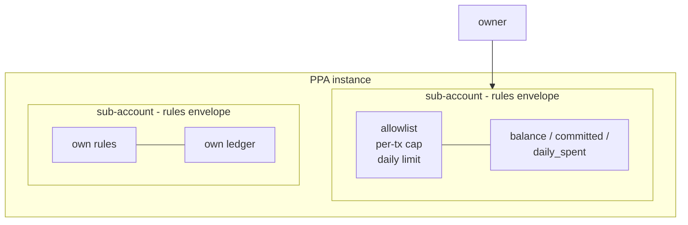
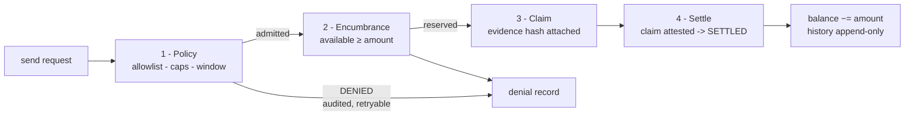

# The Programmable Payment Account (PPA)

### A whitepaper

**Version 0.1 — August 2026**
**Nomos Project · GenLayer Testnet Bradbury**

---

## 1. Abstract

The Programmable Payment Account (PPA) is an on-chain account that holds
committed capital and moves it only through deterministic, rule-gated payment
flows. It is a single Intelligent Contract, deployed once and configured
freely, that packages verified financial mechanisms — policy gates,
encumbrance accounting, evidence-bearing settlement, dispute rectification,
and scoped delegation — behind the verbs people already understand: *send*,
*invoice*, *dispute*, *delegate*.

The PPA exists because correct components are not usable products. The Nomos
project proved eleven primitive mechanisms bottom-up; the PPA composes them
top-down into something a builder can consume in an afternoon. Its defining
constraint is inherited from the primitives' constitution: **no judgment moves
money**. Every value-changing decision inside the PPA is deterministic code
that every validator evaluates identically.

---

## 2. The problem

Payment systems built on traditional infrastructure give developers accounts
with rules: spend limits, approved counterparties, approval workflows,
chargebacks, scheduled payments. Smart contracts gave us trust-minimized
settlement but none of this ergonomics — and adding it ad hoc means every
application re-invents (and re-mis-implements) the same safety mechanisms:
double-spend prevention, authority revocation, dispute handling.

Meanwhile, AI-capable chains introduce a new hazard: judgment in the money
path. A system where a model's output can move funds is a system that can be
prompted out of your money.

The PPA answers both problems at once:

1. **Ergonomics without reinvention.** One contract exposes account semantics;
   the hard mechanisms live below, each independently specified and tested.
2. **Determinism where it matters.** The LLM is welcome in monitoring and
   classification. It is structurally absent from settlement.

---

## 3. Design

### 3.1 The account model

A PPA instance has exactly one **owner**. The owner opens any number of
sub-accounts, each with its own **rules envelope** and ledger:

```json
{
  "daily_limit": "10000",
  "per_tx_limit": "5000",
  "currency": "GEN",
  "allowlist": ["0x…"],
}
```

Each sub-account tracks three quantities: `balance` (total deposited),
`committed` (locked by in-flight obligations), and `daily_spent` (windowed
burn rate). Available funds are always `balance − committed`; overcommitment
is therefore structurally impossible, not merely forbidden.



*Figure 1 — The account model. One owner; many sub-accounts, each pairing its own rules envelope with its own ledger. Available funds = balance − committed at all times.*

### 3.2 The send pipeline

Every payment passes four gates, in order, and no gate can be skipped:



*Figure 2 — The send pipeline. Denials at any gate produce an auditable record that moves no funds and does not consume the payment id; only settlement mutates the balance.*

| Gate | Question | Failure mode |
|---|---|---|
| 1. Policy | Recipient allowlisted? Amount within per-tx and daily limits? | DENIED — recorded for audit; no funds move; id stays retryable |
| 2. Encumbrance | Is available balance sufficient? | DENIED — same properties |
| 3. Claim | Does the payment exist as a claim with evidence hash + memo? | — |
| 4. Settle | Funds move; history written once | — |

Denied payments are first-class records. They are auditable proof that a rule
was tested on-chain, they consume no funds, and they do not burn the payment
identifier: after adjusting a rule, the same id can be retried. This makes
rule changes safely testable.

### 3.3 Invoices

An invoice is a structured receivable: payer, amount, line items, due date.
Issuing creates an open claim. Settling an invoice routes the payment through
the **payer-side** gates — an invoice cannot force money past a rule that would
deny it. This single property reimplements, on-chain, the enforcement gap that
traditional invoicing leaves to law.

### 3.4 Disputes

A settled payment can be disputed within declared economic categories
(settlement mismatch, delivery mismatch, unauthorized payment, amount
mismatch, duplicate). Resolution belongs to the owner with one of three
remedies:

- **refund** — a compensating entry restores the balance; the original payment
  remains in history marked REFUNDED.
- **waive** — the dispute is closed with no action.
- **reject** — the dispute is denied.

History is annotated, never edited. Confirmed truth is immutable; recovery is
a new, linked fact. (Dispute *classification* — deciding what category a
complaint belongs to — is exactly where LLM judgment composes upstream; the
PPA itself accepts the category as declared input.)

### 3.5 Delegation

The owner can grant scoped spending authority to another principal: its own
per-transaction limit, daily limit, and expiry. Two properties are enforced by
construction:

- **Delegation narrows, never widens.** A delegate's payment must satisfy both
  the sub-account's policy *and* the delegation's limits — the effective cap is
  the minimum of the two.
- **Revocation is immediate; expiry is silent.** A revoked or expired delegate
  becomes an unauthorized caller at the next block boundary.

This is the approval-workflow pattern from traditional finance, with authority
that is machine-checkable instead of policy-documentary.

### 3.6 What the PPA deliberately does not do (v0.1)

- **No swap.** Exchange needs liquidity venues that do not yet exist on the
  testnet; wrapping nothing would be theater. The gate pipeline is designed so
  a swap action slots in when a venue exists.
- **No cross-contract calls.** Primitive semantics are embedded in-account.
  Extraction into separate deployed primitives with cross-calls is planned for
  v0.2 once the chain's cross-contract story stabilizes.
- **No autonomous execution of external triggers.** Monitoring feeds exist
  (see §6); their breaches surface as proposed actions that pass through the
  ordinary gates. The PPA never executes on judgment alone.

---

## 4. Security model

- **Deterministic settlement.** All balance-changing logic is plain integer
  arithmetic over digit-string amounts; no floats, no model outputs, no
  oracle dependence in the money path.
- **Authority is explicit.** Every entry point resolves the caller as owner or
  active delegate; there is no default-permissive path.
- **Fail-closed denials.** Every gate denies by returning a structured result,
  never by swallowing an error.
- **Immutable history.** Settlements and denials are permanent records;
  refunds are new compensating facts.
- **Known limitation:** v0.1 embeds primitive logic rather than calling
  deployed primitive contracts, so convergence evidence attaches to the
  composite fingerprint. Cross-contract extraction in v0.2 restores
  per-primitive attestation chains.

---

## 5. Evidence

- **Component level:** the eleven underlying primitives carry canonical vector
  suites (9–17 vectors each, all passing), adversarial test batteries, and —
  as of the August 2026 convergence campaign — independent-build convergence
  for ten of eleven mechanisms: fresh-context builders reading only each
  primitive's specification reproduced it, with every canonical vector passing
  against every independent build (receipts in `convergence/receipts/`).
- **Composite level:** six live flow tests execute the full PPA pipeline
  (settle, deny-and-retry, allowlist denial, insufficient commitment, invoice
  cycle, dispute refund) through GenLayer consensus on GLSim localnet — all
  passing.
- **Network level:** the PPA is deployed on GenLayer Testnet Bradbury
  (chainId 4221) with bytecode verified on-chain, and carries a complete live
  functional verification: account creation, deposit, policy-gated send, and
  settlement confirmed by read-back with exact balance reconciliation
  (`convergence/deployment/ppa-bradbury.json`). Invoice, dispute, and
  delegation paths are sim-proven; their live calls are tracked as open work.

Per the project's evidence language: component behavior is PASS-backed;
testnet functional coverage is expanding and marked as such rather than
claimed complete.

---

## 6. Who can use it

**Application developers.** Any team building wallets, payroll, billing,
marketplace escrow, or treasury tooling on GenLayer. Deploy the PPA, configure
rules, call `send`. No knowledge of the underlying primitives required.

**DAOs and organizations.** Open a PPA per treasury or working group.
Delegate scoped spending authority to contributors with hard caps and expiry;
every movement is rule-checked and auditable on-chain. Disputes replace
"trust me" with a case lifecycle.

**Marketplaces and platforms.** Escrow-shaped flows come free: deposit into a
sub-account, send against evidence hashes, resolve disputes with refunds
rather than forks of the ledger.

**Autonomous agents.** An agent holds a delegation, not a key to the treasury.
Its spending is capped per transaction and per day, expires automatically, and
can be revoked instantly — the missing piece for letting AI act financially
without giving it the keys to everything.

**Financial-system rebuilders.** The recurring-billing pattern is a monitor
trigger plus a gated send; escrow is attestation-gated settlement; invoicing
is native. Teams migrating payment products on-chain compose these patterns
instead of re-deriving them.

---

## 7. Roadmap

- **v0.2** — cross-contract extraction: PPA calls the deployed primitive
  contracts directly, restoring per-primitive convergence attestation.
- **Monitor composition (shipped as the IAS ladder)** — the Intelligent
  Account stack (`ias/`) already composes monitors, correlation, and gated
  autonomous execution on top of the PPA's gate pipeline; see the companion
  whitepaper `INTELLIGENT_ACCOUNT_WHITEPAPER.md`.
- **Swap action** — gated exchange once liquidity venues exist on testnet.
- **Multi-currency commitments** — per-asset sub-account ledgers.
- **financial-contract re-qualification + composite convergence lane** —
  completing 11/11 CONFORMANT and an independent build of the PPA itself.

---

## 8. Conclusion

The PPA is the bridge between two proofs. On one side, eleven primitive
mechanisms proven correct in isolation. On the other, the way people actually
want to use money: accounts with rules, payments with receipts, disputes with
remedies, delegation with limits. The composite keeps the first side's
guarantees intact while delivering the second side's usability — and it draws
one bright line that neither ergonomics nor intelligence is allowed to cross:
**determinism settles; judgment advises.**

*Nomos — financial primitives whose semantics survive any builder.*
